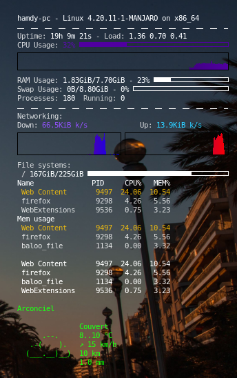

# My conky configuration file with weather. 





## What's this file ?

This is the config of my conky. You have to configure linux to launch conky at startup and put this .conkyrc in you home directory.  


## Weather / Meteo

Modify the last line for your location and language :

```sh
${color #00ff00}${texeci 3600 curl "wttr.in/Arconciel?qT0&lang=fr"}
```
You can find more information there : https://wttr.in/:help


By default it use the eth0 network interface. You can find your network interface with #ifconfig then modify those two lines with the name of the network interface. You have to modify it after downspeed, upspeed, downspeedgraph, upspeedgraph :

```sh
Down:${color #8844ee} ${downspeed eth0} k/s${color lightgrey} ${offset 70}Up:${color #22ccff} ${upspeed eth0} k/s
${color black}${downspeedgraph eth0 32,150 ff0000 0000ff} $alignr${color black}${upspeedgraph eth0 32,150 0000ff ff0000}
```

## Developer - Author

Hamdy Abou El Anein

## Homepage

http://www.daylightlinux.ch 
