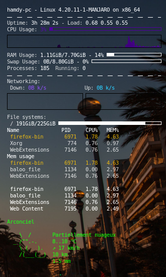

# My conky configuration file with weather. 





## What's this file ?

This is the config of my conky. You have to configure linux to launch conky at startup and put this .conkyrc in you home directory.  


## Weather / Meteo

Modify the last line for your location and language :

```sh
${color #00ff00}${texeci 3600 curl "wttr.in/Arconciel?qT0&lang=fr"}
```

## Developer - Author

Hamdy Abou El Anein

## Homepage

http://www.daylightlinux.ch 
